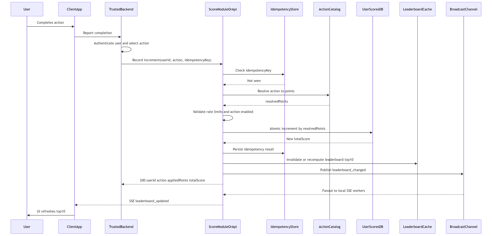
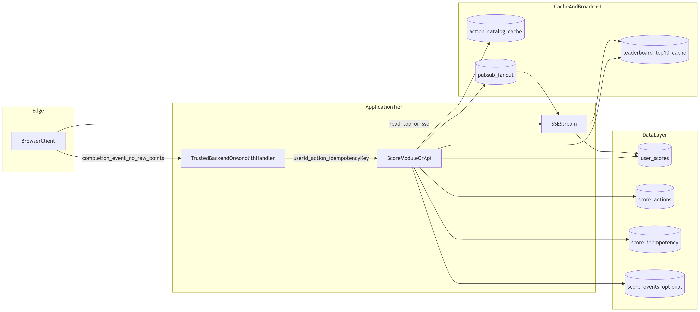

# Problem 6 - Live scoreboard module (specification)

This document specifies a **backend module** for a scoreboard that shows the **top 10** users’ scores with **live updates** via **Server-Sent Events (SSE)**. Score **increments** are triggered only from **trusted server-side code** (never by letting the browser choose how many points to add). **Points are not sent in the request body**: each completion references an **`action`** identifier, and the server applies points using a **configured mapping** `action → points` (§7.3).

**Audience:** backend engineers implementing the API service.

## Quick navigation

- [1. Purpose and scope](#1-purpose-and-scope)
- [2. Actors](#2-actors)
- [3. Trust model and threats](#3-trust-model-and-threats)
- [4. Functional requirements](#4-functional-requirements)
- [5. Security and abuse controls](#5-security-and-abuse-controls)
- [6. API specification (normative)](#6-api-specification-normative)
- [7. Data model (conceptual)](#7-data-model-conceptual)
- [8. Concurrency and consistency](#8-concurrency-and-consistency)
- [9. Operational concerns](#9-operational-concerns)
- [10. Assumptions and open questions](#10-assumptions-and-open-questions)
- [11. Production hardening checklist](#11-production-hardening-checklist)
- [12. Execution flow (diagrams)](#12-execution-flow-diagrams)
- [13. Traceability (requirements → API)](#13-traceability-requirements--api)

**Stakeholder decisions captured in this spec:**

| Topic | Decision |
|-------|----------|
| Live transport | **SSE** (server → browser push) |
| How points are determined | **`action` → points** is defined **only on the server** (config or database). Callers send **`userId` + `action`**; **`delta` / `points` MUST NOT** be supplied by the client or by an untrusted tier-see §6.1. |
| Deployment topology | Production supports both: **distributed** (BFF forwards to score service using service auth) and **monolith** (in-process call after user auth). Both variants MUST keep the same **action-mapping** rule-see §1.3. |
| Read paths (leaderboard / SSE) | May be consumed by the browser (with appropriate end-user or session-based auth) or proxied-**TBD** per deployment. |
| Write-path authentication | **Distributed:** trusted caller credentials (e.g. service JWT, mTLS, HMAC). **Monolith:** same trust boundary as the rest of the app (session / internal call); **browser never sends raw point amounts**. |

---

## 1. Purpose and scope

### 1.1 Goals

1. Persist each user’s **total score** and expose the **top 10** users ranked consistently.
2. Provide **live updates** to connected browsers when the leaderboard (or relevant slice) changes, without requiring clients to poll aggressively.
3. After some **opaque “action”** completes, **trusted server-side code** records the completion using **`userId` + `action`** only (how completion is detected-quiz engine, job, BFF handler-is **out of scope**).
4. Ensure **callers cannot choose arbitrary points**: the numeric increment comes **only** from the **action→points mapping** maintained by the product/backend team-not from request payloads (§6.1, §7.3).
5. Ensure **only trusted backend paths** can trigger increments: **no direct browser calls** that supply scores; in split architectures, use **service authentication** between tiers where applicable (§5).

### 1.2 Non-goals

- Defining or validating **business logic** of the “action” (e.g. game rules, quiz correctness). The score module **trusts** upstream server code to invoke **`recordScore`/`increment`** only when appropriate; it still enforces **registered `action` keys**, **service auth** (when applicable), **rate limits**, and **idempotency** (§5.3). Compromise of backend credentials or the mapping deployment is an operational incident.
- Building the website UI, styling, or client-side state management.
- Choosing a specific cloud vendor, framework, or database product-only **behavioral** and **contract** requirements are normative here.

### 1.3 Deployment variants (same scoring rules)

| Variant | Sketch | Increment invocation |
|--------|--------|----------------------|
| **Distributed (recommended for production)** | Browser → **BFF** → Score HTTP API | BFF sends **`userId` + `action`** with **service** credentials after authenticating the user. Points resolved **inside** the score API from mapping. |
| **Monolith** | Browser → same app server | Handler runs **after** session/auth checks and calls the score submodule **in-process** (or internal route). Payload still **`userId` + `action`**-**never** a caller-supplied **`delta`** from the public internet-facing layer. |

For production, prefer the **distributed** topology when teams/services are separated. Teams running a monolith MUST still enforce the same **action-mapping**, auth, idempotency, and observability requirements.

---

## 2. Actors

| Actor | Role |
|-------|------|
| **Browser / client app** | Displays the scoreboard; completes an action; talks only to **product-owned backends** (session/cookies/API)-**must not** call a public “add N points” endpoint with a numeric **delta**. Opens **SSE** for live updates where exposed (§6.3). |
| **Trusted backend** *(BFF **or** monolith routing layer)* | Authenticates the user, decides that a completion merits **`action` X**, then invokes the score module with **`userId` + `action`** (HTTP to score service **or** in-process call-§1.3). |
| **Score module / Score API service** | Resolves **`action` → points** from the **mapping** (§7.3); validates credentials when HTTP; applies increments atomically; serves leaderboard reads; **emits** SSE events. |
| **Identity / auth issuer** *(often external)* | Issues end-user tokens or delegates sessions-consumed by the **trusted backend**, not by the score-only tier except for read APIs if applicable. Details **TBD** (§10). |
| **Database** | Durable storage for scores, idempotency records, action catalog, and score event history. |
| **Broadcast channel** *(production requirement for scale)* | In multi-instance deployments, a shared **pub/sub** layer (e.g. Redis) fans out `leaderboard_changed` so every API instance can push to its local SSE clients (§9). |

---

## 3. Trust model and threats

### 3.1 Intended guarantee

- An **untrusted browser** cannot choose **how many points** to add: numeric increments come **only** from **server-side** `action`→points **mapping**, not from user-supplied JSON fields.
- The **increment surface** (HTTP or internal) is reachable only from **trusted backend** code (same host in monolith, or **service authentication** between services).
- A malicious party **without** trusted-caller material **cannot** forge accepted increment requests (within the limits of **mTLS / HMAC / service JWT** where used).
- **Replay** of the same legitimate completion (network retry) must not **double-apply** points when **idempotency** is used correctly (§6.1).

### 3.2 Residual risks (document for operators)

| Risk | Mitigation direction |
|------|----------------------|
| **Compromised backend or leaked service credentials** | Key rotation, narrow network ACLs, audit logs, alerting; treat as **incident** scope. |
| **Malicious or buggy caller** (calls increment too often or wrong `action`) | **Rate limits** per `userId`/`action`; monitoring; optional **signed completion** payloads (§11). **Action catalog** limits which keys exist-no arbitrary point amounts in payloads. |
| **Stolen end-user session** | Same as any web app: short-lived sessions, HTTPS; **never** expose “set score to X” from that layer. |
| **Collusion / Sybil accounts** | Product policy; optional anomaly detection (§11). |
| **Horizontal scaling without shared fan-out** | SSE clients on instance A miss updates processed on B unless **pub/sub** or **sticky sessions** are implemented (§9). |

---

## 4. Functional requirements

| ID | Requirement |
|----|-------------|
| FR-1 | The system SHALL maintain a **numeric total score** per user identifier (string id agreed with the identity / product layer). |
| FR-2 | The system SHALL expose the **top 10** users by score. **Tie-breaking** SHALL be **deterministic** (see §7.2). |
| FR-3 | The system SHALL provide a way to **record** a score increase by **`userId`** and **`action`** (see §6.1). The **points added** SHALL be **derived only** from the **action→points mapping** (§7.3), **not** from a caller-supplied **delta** on public/untrusted paths. |
| FR-3a | The system SHALL maintain a **mapping** from **`action`** (string key) to **non-negative integer points** (and MAY attach metadata such as daily caps-**TBD**). Unknown **`action`** SHALL be rejected (**400**). |
| FR-4 | When exposed as HTTP, the increment endpoint SHALL reject missing or invalid **trusted-caller** authentication with **401** (where that layer applies); monolith internal calls rely on the hosting app’s trust boundary. |
| FR-5 | The system SHALL provide an **SSE** endpoint that pushes **leaderboard update events** so clients can refresh the top 10 **without polling**. |
| FR-6 | The system SHOULD support **idempotent** increments via `Idempotency-Key` so retries do not double-count (§6.1). |

---

## 5. Security and abuse controls

### 5.1 Authentication (two layers)

**A - Increment writes (`POST /v1/score/increment` or internal equivalent)**

- **Caller:** Trusted backend code only. **Public browsers MUST NOT** submit a numeric **`delta`** or **`points`** field for scoring on internet-facing routes.
- **Distributed deployments:** e.g. **`Authorization: Bearer <service_JWT>`** with `aud` = score API; **mTLS**; **HMAC**; API keys on private networks (**TBD**). The score API MUST verify **service identity** before applying any increment.
- **Monolith:** increment is invoked **after** the same session/auth checks as other mutations-typically an **in-process** call; **no** separate service token is required, but the **`action`→points** rule still applies.

**B - Leaderboard reads (HTTP GET / SSE)**

- End-user or anonymous access depending on product: e.g. **`Authorization: Bearer <user_JWT>`** for personalized views, **public** top 10, or **cookie session**. Normative details for read paths remain **TBD** except that they MUST NOT bypass write protections.

Exact algorithms (e.g. RS256), JWKS URLs, and claim mapping are **deployment-specific** (§10).

### 5.2 Authorization rule for increments

- The logical request MUST include **`userId`** and **`action`**. The **`userId`** MUST correspond to the user already authenticated by the calling tier (BFF or monolith handler).
- **`delta` / `points` MUST NOT** appear in the **normative** public contract-implementations MUST resolve points **only** via **`action`** using the **mapping** (§7.3). *(Private admin tooling **may** use a separate, heavily guarded mechanism-**out of scope**.)*
- The score API MUST **not** infer the target user from an **end-user** browser token **on the increment HTTP handler** in split architectures-consistent with “no direct client writes.”

### 5.3 Abuse controls (normative behavior)

| Control | Behavior |
|---------|----------|
| **Action validation** | Reject unknown **`action`** keys (**400**). Reject mappings where **resolved points** are **0** unless product explicitly allows no-ops (**TBD**). |
| **Mapping integrity** | Points per **`action`** are **only** changed via **deployed configuration / DB** managed by the backend team-not via client payloads. |
| **Rate limiting** | Return **429** when limits exceeded: recommend **per calling service** (if distributed), **per target `userId`**, **per `action`**, and optionally **per IP** (exact quotas **TBD**; see §10). |
| **Idempotency** | If `Idempotency-Key` is present, the same key MUST NOT apply the increment twice for the same **`userId`** + **`action`** context (§6.1). |

---

## 6. API specification (normative)

Base path is illustrative; implementations SHOULD version public APIs (e.g. `/v1`).

### 6.1 `POST /v1/score/increment`

Increases the **specified** user’s score by resolving **`action` → points** on the server. **Caller:** trusted backend tier **only** (see §1.3, §5.1).

**Normative rule:** The JSON body **MUST NOT** include **`delta`**, **`points`**, or any field that lets the caller choose the numeric increment. Implementations MUST compute `resolvedPoints = mapping(action)` **inside** the score module.

**Headers**

| Header | Required | Description |
|--------|----------|-------------|
| `Authorization` | Yes (distributed) | **Service** credential when the score API is a separate process-see §5.1. *(Omitted when modeled as pure in-process call in monolith docs.)* |
| `Idempotency-Key` | Recommended | Unique key per completed action instance (e.g. UUID). **Required** for safe retries in production. |
| `Content-Type` | Yes | `application/json` |

**Request body**

```json
{
  "userId": "user_123",
  "action": "quiz_level_complete"
}
```

- **`userId`**: stable user identifier string-the user authenticated by the calling tier for this completion.
- **`action`**: key into the **action→points** catalog (§7.3). Examples are illustrative; real keys are **product-defined**.

**Successful response** (`200 OK`)

```json
{
  "userId": "user_123",
  "action": "quiz_level_complete",
  "appliedPoints": 10,
  "totalScore": 42,
  "rank": null
}
```

- **`appliedPoints`**: **optional but recommended**-echoes the resolved increment from the mapping (aids debugging and audits).

*Note:* Including **`rank`** is optional; may be `null` if expensive to compute per request. Clients refresh rank via SSE or a separate read API.

**Errors (stable JSON shape)**

```json
{
  "error": "human_readable_code",
  "message": "Optional detail"
}
```

| HTTP | When |
|------|------|
| `400` | Invalid body, unknown **`action`**, or disallowed **`action`** for this deployment |
| `401` | Missing or invalid **service** credentials |
| `403` | Caller authenticated as service but not allowed (if rules extended later) |
| `409` | Idempotency conflict (same key, different payload)-optional if implemented |
| `429` | Rate limited |

### 6.2 `GET /v1/leaderboard/top`

Returns current **top 10** (snapshot). Useful for first paint and non-SSE clients.

**Response** (`200 OK`) - illustrative:

```json
{
  "entries": [
    { "rank": 1, "userId": "user_a", "score": 1000, "updatedAt": "2026-05-06T12:00:00.000Z" },
    { "rank": 2, "userId": "user_b", "score": 980, "updatedAt": "2026-05-06T11:59:00.000Z" }
  ]
}
```

Display names / avatars are **out of scope** unless a user profile service is defined (**TBD**).

### 6.3 `GET /v1/leaderboard/stream` (SSE)

- **Headers:** `Accept: text/event-stream`.
- **Auth:** Implementation choice:
  - **Option A:** Same **Bearer** token as query `access_token` *(not ideal for logs)* or **cookie session** if same-origin.
  - **Option B (recommended):** Short-lived **SSE-specific token** issued after primary auth (**TBD**).

**Event format**

- **`event`:** `leaderboard_updated` (or send unnamed messages with JSON payloads only-prefer named events).
- **Payload:** JSON document containing either full **top 10 snapshot** or a minimal diff; production default SHOULD send **full top-10 snapshot** unless bandwidth profiling proves diffs are required.

```text
event: leaderboard_updated
data: {"entries":[...],"generatedAt":"2026-05-06T12:00:00.000Z"}

```

**Heartbeat:** Send SSE comments periodically (e.g. `: ping\n\n`) every **15–30 s** to defeat idle timeouts through proxies (**exact interval TBD**).

**Reconnection:** Clients SHOULD reconnect with exponential backoff. **`Last-Event-ID`** resume is optional (browser support and cache semantics vary); if not implemented, clients MUST call `GET /v1/leaderboard/top` after reconnect to resync.

---

## 7. Data model (conceptual)

### 7.1 Recommended approach

| Approach | Description | Pros | Cons |
|----------|-------------|------|------|
| **A - Materialized total** | Table `user_scores(user_id PK, total INT, updated_at)` | Simple reads for top 10 | Less audit detail |
| **B - Event log + materialized** | Table `score_events` + aggregated `user_scores` updated in transaction | Full audit, dispute resolution | More storage and write path work |

**Recommendation (production):** use **B (event log + materialized score)** as the default for auditability and forensic analysis. If using **A** only, document explicit acceptance of reduced audit capability.

### 7.2 Tie-breaking (required)

When two users have the **same score**, ordering MUST be stable, for example:

1. **Higher score first** (descending).
2. **Earlier `updated_at` wins** (ascending)-user who reached that score **first** ranks higher.

If `updated_at` is identical, fall back to **`user_id` ascending** (lexicographic).

Document the chosen rule in deployment runbooks; **tests MUST assert** stability.

### 7.3 Action → points mapping (required)

The module MUST define a **catalog** that maps each allowed **`action`** string to a **non-negative integer** number of points (and MAY include extra columns or config for descriptions, enabled flags, or per-action rate limits).

**Illustrative** storage options:

| Option | Description |
|--------|-------------|
| **Database table** | e.g. `score_actions(action_id PK, points INT NOT NULL, enabled BOOLEAN …)` - enables **runtime** toggles with migrations or admin tools. |
| **Versioned config** | e.g. YAML/JSON in repo loaded at startup - simple for monoliths; requires **redeploy** to change points. |

**Rules**

- Adding or changing point values is a **backend change** (migration or deploy), **not** something end users or browsers control.
- **`action`** keys SHOULD use a **stable namespace** (e.g. `quiz_level_complete`, `daily_login`) to avoid collisions.
- If the same logical completion could map to different keys over time, **version** the key (e.g. `campaign_2026_share`) rather than reusing semantics with different point values.

### 7.4 Database design (proposed schema)

This section proposes a relational schema suitable for PostgreSQL (or equivalent SQL database).

**Core tables**

1. `user_scores`
   - `user_id` (PK, text/varchar)
   - `total_score` (bigint or integer based on product limits)
   - `updated_at` (timestamp with timezone, indexed for tie-break)
2. `score_actions`
   - `action_id` (PK, text/varchar)
   - `points` (integer, non-negative)
   - `enabled` (boolean)
   - `updated_at` (timestamp with timezone)
3. `score_idempotency`
   - `idempotency_key` (PK, text/varchar)
   - `user_id` (text/varchar)
   - `action_id` (text/varchar)
   - `request_hash` (text/varchar, optional but recommended)
   - `created_at` (timestamp with timezone)
   - `expires_at` (timestamp with timezone)
4. `score_events` (required in production for audit)
   - `event_id` (PK, UUID/text)
   - `user_id` (text/varchar)
   - `action_id` (text/varchar)
   - `applied_points` (integer)
   - `source` (text, e.g. `bff`, `monolith`)
   - `created_at` (timestamp with timezone)

**Suggested indexes**

- `user_scores(total_score DESC, updated_at ASC, user_id ASC)` for top-10 reads.
- `score_events(user_id, created_at DESC)` for audit/debug queries.
- `score_idempotency(expires_at)` for cleanup jobs.

### 7.5 Cache design (leaderboard + action catalog)

**Cache goals**

- Minimize repeated DB reads for `GET /v1/leaderboard/top`.
- Keep SSE fan-out fast with low write amplification.

**Recommended cache layers**

1. **Leaderboard cache** (Redis for production)
   - Key: `leaderboard:top10`
   - Value: serialized top-10 snapshot (`entries`, `generatedAt`)
   - TTL: short (e.g. 2-10 seconds) plus event-based refresh on score changes.
2. **Action catalog cache**
   - Key pattern: `score_action:{actionId}` or bulk key `score_actions:all`
   - Refresh: on config reload / DB change signal / short TTL.
3. **Optional rank cache** for hot users
   - Key: `score_rank:{userId}` (if rank is frequently requested).

**Invalidation strategy**

- On successful increment:
  - Update DB transaction first (source of truth),
  - Invalidate/recompute `leaderboard:top10`,
  - Publish `leaderboard_changed` to pub/sub,
  - Push SSE update to subscribers.
- If cache is unavailable, API MUST fall back to DB (degraded but correct behavior).

---

## 8. Concurrency and consistency

- Score updates MUST be **atomic** at persistence layer (e.g. single `UPDATE ... SET total = total + :resolvedPoints ... RETURNING` where **`resolvedPoints`** comes **only** from the **`action` mapping**, or equivalent).
- Concurrent increments for the **same user** MUST NOT lose updates (no read-modify-write races).
- Top-10 read MAY be **eventually consistent** relative to writes by a **small** lag if a cached read model is used; if so, document maximum staleness (**TBD**).

---

## 9. Operational concerns

| Topic | Guidance |
|-------|----------|
| **CCU assumption** | Initial production sizing: **5k CCU baseline**, **10k CCU target**, **20k CCU stress** for live viewers. Revalidate continuously with product/SRE and load tests. |
| **SSE connection limits** | Each instance has finite open connections; set reverse-proxy timeouts and OS limits appropriately. |
| **Multi-instance** | Production MUST run at least **2+ stateless instances** per environment for availability. Without sticky sessions, SSE clients connect to random instances; shared fan-out (e.g. Redis pub/sub) ensures all instances emit updates after a write. |
| **Backpressure** | If emit fails for a client, drop connection and let client reconnect. |
| **Availability target** | Define and monitor SLO, e.g. **99.9%** monthly availability for write/read APIs and SSE stream establishment. |
| **Disaster recovery** | Define RTO/RPO (example: **RTO 30 min**, **RPO 5 min**) and test DB restore + cache cold-start procedures regularly. |
| **Observability** | MUST emit metrics/logs/traces: write latency, SSE active connections, publish-to-delivery lag, idempotency hit rate, cache hit ratio, error rates by endpoint. |

---

## 10. Assumptions and open questions

Items marked **assumption** are working hypotheses for implementers; **TBD** requires product or security sign-off.

| Topic | Status | Notes |
|-------|--------|-------|
| End-user auth (trusted backend) | **TBD** | Session, OAuth, or user JWT-used **before** emitting **`userId` + `action`**; **not** required by every deployment variant (§1.3). |
| Service auth (distributed only) | **TBD** | mTLS, HMAC, or service JWT (`iss`/`aud` for score API); **N/A** for pure in-process monolith calls. |
| JWT issuer, JWKS, algorithms | **TBD** | **If** using JWTs for the service layer, must match the agreed identity/infra. |
| Action catalog (`action` → points) | **TBD / product-owned** | Single source of truth in DB or config; largest **`points`** per action bounds abuse surface alongside rate limits. |
| CCU target | **production baseline: 5k / target: 10k / stress: 20k** | Drives infra sizing for SSE connections, Redis/pubsub throughput, and DB read load. |
| Rate limits (per user / per IP) | **TBD** | Set production defaults and tune via telemetry (example starting point: **60/min per user**, **300/min per IP**). |
| SSE authentication mechanism | **TBD** | Prefer short-lived SSE token over long-lived query params. |
| User display names on leaderboard | **TBD** | May return opaque IDs only. |
| Multi-tenant | **TBD** | Explicitly choose single-tenant or multi-tenant and enforce partitioning strategy before launch. |
| Data retention / GDPR | **TBD** | Deletion of user → zero score or remove from board. |
| Locale / display formatting | **N/A for backend** | API exposes structured numbers and **ISO 8601** timestamps (UTC). **Rendering** (thousands separators, date locale, copy) is a **client** concern unless a future API adds localized fields (**TBD**). |

### Stakeholder note (production intent)

**SSE** and **no caller-supplied point amounts** ( **`action`→points mapping** ) are confirmed. This document is now **production-first**: assume HA deployment, shared cache/pubsub, and auditable score history. Remaining TBD items (tenant model, exact auth integration, quotas) require explicit sign-off before go-live.

---

## 11. Production hardening checklist

These items are recommended before or during production rollout.

1. **Append-only `score_events`** and periodic reconciliation for audits and dispute handling.
2. **Cached top-10 read model** (Redis sorted set) if read QPS dominates; invalidate or refresh on write.
3. **WebSockets** only if bidirectional features are needed; SSE is sufficient for push-only leaderboards.
4. **Anomaly detection** on increment frequency **per `userId` / `action`**; alert or soft-block.
5. **Feature flags:** disable **`action`** keys or reduce mapped points without redeploying client apps (if catalog is DB-backed).
6. **Signed “completion” payloads** between subsystems if the product requires **stronger** proof than session trust alone-orthogonal to **BFF vs monolith**.

### 11.1 DevOps metrics, SLI/SLO, and alerts

Production MUST define dashboards and alerts at minimum for the following metric families.

| Area | Metric (suggested name) | Target / SLO hint | Alert hint |
|------|--------------------------|-------------------|------------|
| **Write API** | `score_increment_requests_total{status}` | Success rate >= 99.9% (5m rolling) | Page if 5xx ratio > 1% for 10m |
| **Write latency** | `score_increment_latency_ms` (p50/p95/p99) | p95 < 150ms, p99 < 300ms (regional) | Warn if p95 breaches 15m |
| **Leaderboard read** | `leaderboard_top_requests_total{status}` | Success rate >= 99.9% | Page if 5xx ratio > 1% for 10m |
| **SSE availability** | `sse_connect_success_ratio` | >= 99.9% monthly | Page if < 99.5% for 10m |
| **SSE load** | `sse_active_connections` by instance | Under configured max per pod/node | Warn at 80%, page at 95% |
| **Realtime lag** | `pubsub_to_sse_delivery_lag_ms` | p95 < 1000ms | Page if p95 > 3s for 10m |
| **Cache performance** | `leaderboard_cache_hit_ratio` | >= 0.90 (or product target) | Warn if < 0.80 for 15m |
| **Idempotency** | `idempotency_hits_total`, `idempotency_conflicts_total` | Stable/expected baseline | Warn on sudden conflict spikes |
| **Abuse controls** | `rate_limit_trigger_total{scope}` | Informational baseline | Warn on abnormal spikes per action |
| **Data correctness** | `score_update_db_errors_total` | Near zero | Page on sustained non-zero rate |

**Tracing requirements**

- Distributed traces MUST include spans: `auth`, `idempotency_check`, `action_catalog_lookup`, `db_increment`, `cache_update`, `pubsub_publish`, `sse_push`.
- Propagate correlation identifiers (`trace_id`, request id, idempotency key) across backend → score module → pub/sub paths.

**Log requirements**

- Structured logs only (JSON): `timestamp`, `level`, `service`, `env`, `userIdHash`, `action`, `result`, `latencyMs`, `traceId`.
- Never log raw access tokens or sensitive PII.
- Keep immutable audit logs for score mutations (append-only stream or equivalent).

### 11.2 DevOps patterns and runbook expectations

| Pattern | How to apply in this module |
|--------|------------------------------|
| **Stateless service + external state** | Keep API instances stateless; persist truth in DB and Redis/pubsub. |
| **Horizontal scaling** | Scale on CPU + `sse_active_connections`; load-test to set safe max connections per instance. |
| **Backpressure and load shedding** | Reject/close unhealthy SSE connections first, preserve write-path correctness; return 429 when throttled. |
| **Retry with idempotency** | Clients/backends can retry `POST /score/increment` only with `Idempotency-Key`; server must deduplicate. |
| **Circuit breaker / timeout budgets** | Apply tight timeouts for cache/pubsub dependencies; fall back to DB for reads when cache unavailable. |
| **Graceful shutdown** | Drain SSE clients and stop accepting new streams before pod termination; preserve in-flight writes. |
| **Blue-green / canary deploy** | Roll out score logic and action-catalog changes gradually; monitor error budget and realtime lag. |
| **Config as code** | Keep action catalog, rate limits, and alert thresholds versioned and reviewed. |
| **Disaster recovery drill** | Run scheduled restore tests for DB backup and verify cache rebuild + SSE recovery behavior. |
| **Capacity revalidation** | Re-run load tests whenever CCU target or action traffic profile changes materially. |

**Minimum runbooks**

1. **High SSE failure rate**: verify ingress/proxy limits, cert expiry, and pub/sub health.
2. **Lag spike**: inspect Redis/pubsub saturation, queue depth, and per-instance connection pressure.
3. **Write error spike**: inspect DB locks/contention, connection pool, idempotency store hot keys.
4. **Cache outage**: switch to DB-backed reads, scale read replicas if needed, restore cache gradually.

---

## 12. Execution flow (diagrams)

### 12.1 Sequence - increment and live update



### 12.2 Components - deployment view



---

## 13. Traceability (requirements → API)

| FR | Realization |
|----|-------------|
| FR-1, FR-3, FR-3a | `POST /v1/score/increment` (or internal call) + **`userId`** + **`action`** + **catalog** lookup + DB |
| FR-2 | `GET /v1/leaderboard/top` + deterministic ordering |
| FR-5 | `GET /v1/leaderboard/stream` |
| FR-6 | `Idempotency-Key` + idempotency store |

---

*End of specification.*
